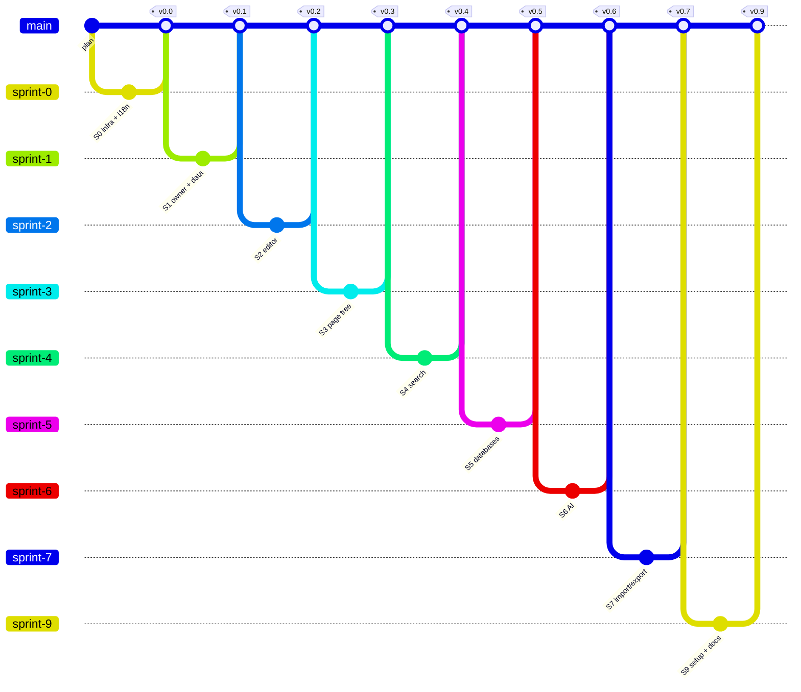

<div dir="rtl">

# mynoteai

[English](README.md) · **עברית**

מחברת אישית בסגנון Notion, שסוכני הבינה המלאכותית שלך קוראים וכותבים בה דרך MCP. קוד פתוח למפתחים: כל אחד מתקין עותק משלו, עם חשבון Vercel ופרויקט Firebase משלו. משתמש יחיד בכל התקנה, בלי שרת מרכזי ובלי הרשמה.

> הפרויקט בפיתוח: העורך, עץ העמודים, החיפוש, מסדי הנתונים ושרת ה-MCP עובדים. הבאים בתור: פרסום, ייבוא וייצוא, וסקריפט התקנה. ההתקדמות מול התוכנית: [`docs/plan.html`](docs/plan.html).

## עברית

- ממשק בעברית ובאנגלית, עם פריסה מלאה מימין לשמאל.
- כיוון לכל בלוק לפי התוכן — אפשר לערבב עברית ואנגלית באותו עמוד.
- חיפוש שמבין אותיות שימוש (ה, ו, ב, ל…).
- תבניות עמוד ונתוני דוגמה בשתי השפות.

## חיבור לסוכנים (MCP)

המחברת לא מריצה מודל ולא מחזיקה מפתח API. היא שרת [MCP](https://modelcontextprotocol.io) בכתובת `/api/mcp`, והסוכן שכבר עובד איתך — Claude Code, Claude Desktop, Cursor — מחפש בה, קורא עמודים וכותב.

1. יוצרים טוקן, שומרים אותו במשתנה `MCP_TOKEN` (ב-Vercel: Settings ← Environment Variables) ופורסים מחדש:

   <div dir="ltr">

   ```bash
   node -e "console.log(require('crypto').randomBytes(32).toString('base64url'))"
   ```

   </div>

2. מתחברים, למשל מ-Claude Code:

   <div dir="ltr">

   ```bash
   claude mcp add --transport http mynoteai https://<your-app>.vercel.app/api/mcp --header "Authorization: Bearer <MCP_TOKEN>"
   ```

   </div>

בעמוד **סוכנים (MCP)** באפליקציה (בסרגל הצד) יש אותן הוראות גם ל-Claude Desktop ול-Cursor, עם הכתובת שלך כבר בפנים.

הכלים: `search_pages`, `list_pages`, `get_page`, `query_database` לקריאה; `create_page`, `append_to_page`, `update_page`, `create_database`, `add_database_row`, `update_database_row`, `move_to_trash` לכתיבה. עמודים נכנסים ויוצאים כ-Markdown. שום דבר לא נמחק לצמיתות: הכול עובר לסל המחזור. עמוד פתוח באפליקציה מתעדכן מיד כשסוכן כותב בו.

הטוקן הוא מפתח מלא למחברת, ושומרים אותו כמו סיסמה. בלי `MCP_TOKEN` הכתובת לא קיימת. ב-`pnpm dev` טוקן קבוע מ-`.env.development` פותח רק את האמולטור.

## מחסנית

| שכבה | בחירה |
|---|---|
| מסגרת | Next.js 16 (App Router) + TypeScript |
| עורך | [BlockNote](https://github.com/TypeCellOS/BlockNote) — ליבה בלבד (MPL-2.0) |
| נתונים, התחברות, קבצים | Firebase (Firestore, Auth, Storage) |
| ממשק | Tailwind + shadcn/ui (RTL), next-intl |
| סוכנים | שרת MCP ‏([mcp-handler](https://github.com/vercel-labs/mcp-handler)) מעל Firebase Admin |
| פריסה | Vercel |

## תוכנית

התוכנית המלאה — רשימת המאגרים שנבחרו ונדחו, ספרינטים, סיכונים — ב-[`docs/plan.html`](docs/plan.html).

| ספרינט | נושא |
|---|---|
| 0 | תשתית, שפות ו-RTL, בדיקת עברית ב-BlockNote |
| 1 | בעלים יחיד, מבנה נתונים, הרצה מקומית בלי חשבון |
| 2 | העורך ושמירה אוטומטית |
| 3 | עץ עמודים בסרגל הצד, תבניות עמוד |
| 4 | חיפוש וחלון פקודות |
| 5 | מסדי נתונים: טבלה וקנבן |
| 6 | שרת MCP: סוכנים מחפשים, קוראים וכותבים במחברת |
| 7 | פרסום, ייבוא וייצוא |
| ~~8~~ | ~~עריכה משותפת~~ — בוטל, משתמש יחיד |
| 9 | הפצה למפתחים: סקריפט התקנה, Deploy to Vercel, מדריך — v1.0 |

## גרף גיט מתוכנן

ענף לכל ספרינט, מיזוג ל-`main` ותגית בסוף כל ספרינט. הגרף המפורט, ברמת משימה, ב-[`docs/plan.html`](docs/plan.html).



## בקרה מול התוכנית

כל קומיט בענף ספרינט מתחיל במזהה משימה (`S1-3: …`). הסקריפט משווה את היסטוריית git לתוכנית ומדווח על סטיות:

```bash
node scripts/plan-check.mjs
```

- `--write` — מעדכן את `docs/progress.js`, והדף `plan.html` מציג ממנו סטטוס לכל משימה וגרף בפועל.
- `--verify` — מריץ גם את פקודת האימות של כל ספרינט שהתחיל.

GitHub Actions מריץ את הבדיקה על כל דחיפה ו-PR. הכללים המלאים ב-[`CLAUDE.md`](CLAUDE.md).

## רישיון

[MIT](LICENSE). הפרויקט לא משתמש בחבילות `@blocknote/xl-*`, שהן ברישיון GPL-3.0.

</div>
