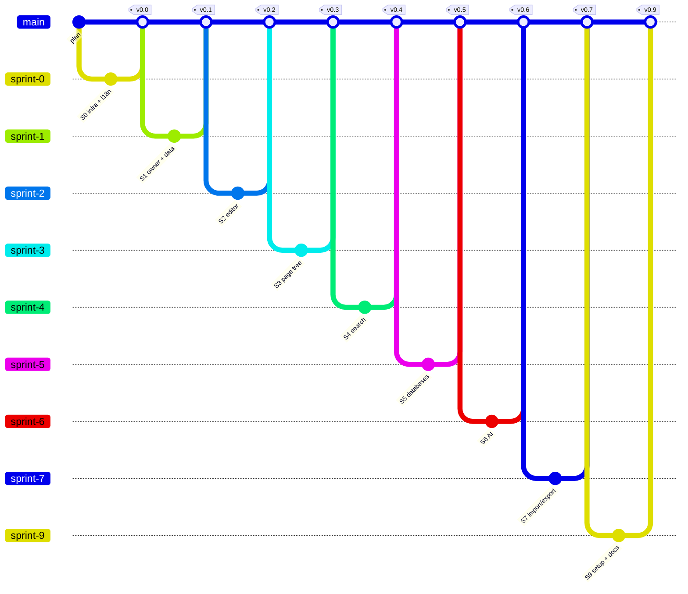

# mynoteai

**English** · [עברית](README.he.md)

A personal, Notion-style notebook that your AI agents can read and write over MCP. Open source for developers: everyone installs their own copy, on their own Vercel account and Firebase project. One user per install — no central server, no sign-ups.

> Status: in development — the editor, page tree, search, databases and the MCP server work; publishing, import/export and the install script are next. Progress against the plan: [`docs/plan.html`](docs/plan.html).

## Hebrew and RTL

Hebrew is a first-class language, not an afterthought:

- UI in English and Hebrew, with full right-to-left layout.
- Text direction per block, so Hebrew and English can be mixed on the same page.
- Search that understands Hebrew prefixes (ה, ו, ב, ל…).
- Page templates and sample data in both languages.

## Connect an agent (MCP)

The notebook runs no model and holds no API key. Instead it is an [MCP](https://modelcontextprotocol.io) server at `/api/mcp`, so the agent you already use — Claude Code, Claude Desktop, Cursor — can search it, read pages and write to it.

1. Create a token and set it as `MCP_TOKEN` (on Vercel: Settings → Environment Variables), then redeploy:

   ```bash
   node -e "console.log(require('crypto').randomBytes(32).toString('base64url'))"
   ```

2. Connect, for example from Claude Code:

   ```bash
   claude mcp add --transport http mynoteai https://<your-app>.vercel.app/api/mcp --header "Authorization: Bearer <MCP_TOKEN>"
   ```

The app's **Agents (MCP)** page (in the sidebar) has the same instructions for Claude Desktop and Cursor, with your address filled in.

Tools: `search_pages`, `list_pages`, `get_page`, `query_database` to read; `create_page`, `append_to_page`, `update_page`, `create_database`, `add_database_row`, `update_database_row`, `move_to_trash` to write. Pages go in and out as Markdown. Nothing is deleted for good: the trash keeps it. A page open in the app updates as soon as an agent writes to it.

The token is a full key to the notebook: keep it like a password. Without `MCP_TOKEN`, the endpoint does not exist. Under `pnpm dev` a fixed token from `.env.development` opens the emulator only.

## Stack

| Layer | Choice |
|---|---|
| Framework | Next.js 16 (App Router) + TypeScript |
| Editor | [BlockNote](https://github.com/TypeCellOS/BlockNote) — core packages only (MPL-2.0) |
| Data, auth, files | Firebase (Firestore, Auth, Storage) |
| UI | Tailwind + shadcn/ui (RTL), next-intl |
| Agents | MCP server ([mcp-handler](https://github.com/vercel-labs/mcp-handler)) over Firebase Admin |
| Hosting | Vercel |

## Roadmap

The full plan — chosen and rejected libraries, sprints, risks — lives in [`docs/plan.html`](docs/plan.html) (written in Hebrew).

| Sprint | Scope |
|---|---|
| 0 | Project skeleton, i18n and RTL foundations, BlockNote Hebrew check |
| 1 | Single owner, data model, local dev on the Firebase Emulator with no account |
| 2 | Editor and autosave |
| 3 | Page tree, page templates |
| 4 | Search and command palette |
| 5 | Databases: table and kanban views |
| 6 | MCP server: agents search, read and write the notebook |
| 7 | Publishing, import and export |
| ~~8~~ | ~~Collaboration~~ — dropped, single user |
| 9 | Developer distribution: setup script, Deploy to Vercel, install guide — v1.0 |

## Planned git graph

One branch per sprint, merged into `main` and tagged when the sprint closes. The task-level graph is in [`docs/plan.html`](docs/plan.html).



## Plan check

Every commit on a sprint branch starts with a task id (`S1-3: …`). A script compares the git history with the plan and reports deviations:

```bash
node scripts/plan-check.mjs
```

- `--write` — updates `docs/progress.js`; `plan.html` reads it to show per-task status and the actual graph.
- `--verify` — also runs the verification command of every sprint that has started.

GitHub Actions runs the check on every push and pull request.

## License

[MIT](LICENSE). The project does not use the `@blocknote/xl-*` packages, which are GPL-3.0.
