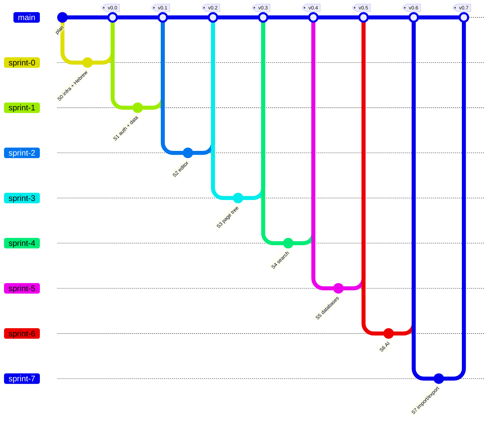

# mynoteai

מערכת פתקים בסגנון Notion, עם עוזר בינה מלאכותית. קוד פתוח, פרוסה ב-Vercel.

> הפרויקט בשלב תכנון. עדיין אין קוד יישום.

## מחסנית

| שכבה | בחירה |
|---|---|
| מסגרת | Next.js 16 (App Router) + TypeScript |
| עורך | [BlockNote](https://github.com/TypeCellOS/BlockNote) — ליבה בלבד (MPL-2.0) |
| נתונים, התחברות, קבצים | Firebase (Firestore, Auth, Storage) |
| ממשק | Tailwind + shadcn/ui |
| בינה מלאכותית | Vercel AI SDK + חיפוש וקטורי של Firestore |
| פריסה | Vercel |

## תוכנית

התוכנית המלאה — רשימת המאגרים שנבחרו ונדחו, ספרינטים, סיכונים — ב-[`docs/plan.html`](docs/plan.html).

| ספרינט | נושא |
|---|---|
| 0 | תשתית ובדיקת עברית ב-BlockNote |
| 1 | התחברות ומבנה נתונים |
| 2 | העורך ושמירה אוטומטית |
| 3 | עץ עמודים בסרגל הצד |
| 4 | חיפוש וחלון פקודות |
| 5 | מסדי נתונים: טבלה וקנבן |
| 6 | בינה מלאכותית |
| 7 | פרסום, ייבוא וייצוא |
| 8 | עריכה משותפת (רשות) |

## גרף גיט מתוכנן

ענף לכל ספרינט, מיזוג ל-`main` ותגית בסוף כל ספרינט. הגרף המפורט, ברמת משימה, ב-[`docs/plan.html`](docs/plan.html).



## בקרה מול התוכנית

כל קומיט בענף ספרינט מתחיל במזהה משימה (`S1-3: …`). הסקריפט משווה את היסטוריית git לתוכנית ומדווח על סטיות:

```bash
node scripts/plan-check.mjs
```

- `--write` — מעדכן את `docs/progress.js`, והדף `plan.html` מציג ממנו סטטוס לכל משימה וגרף בפועל.
- `--verify` — מריץ גם את פקודת האימות של כל ספרינט שהתחיל.

GitHub Actions מריץ את הבדיקה על כל דחיפה ו-PR. הכללים המלאים ב-[`CLAUDE.md`](CLAUDE.md).

## רישיון

[MIT](LICENSE). הפרויקט לא משתמש בחבילות `@blocknote/xl-*`, שהן ברישיון GPL-3.0.
